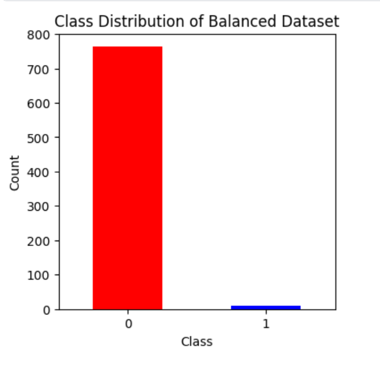
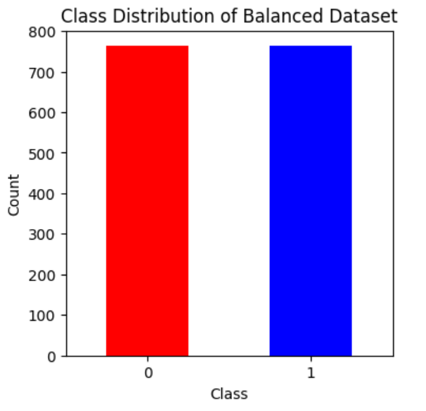

# Sampling Assignment
Sampling is a critical aspect of the machine learning workflow, involving the selection of data points from a dataset for training, testing, and validation. Different sampling methods are employed to ensure that the selected data is representative and generalizable.

## Dataset
The credit card fraud dataset used in this project is taken from:
[Credit Card Fraud Dataset](https://github.com/AnjulaMehto/Sampling_Assignment/blob/main/Creditcard_data.csv)

The dataset comprises of 31 columns and 772 entries, with a target variable labelled as 'Class'. This variable takes value of '0' or '1'. The dataset is imbalanced, with 763 entries classified as Class '0' and only 9 entries as Class '1'.

## Balancing the Dataset
SMOTE (Synthetic Minority Over-sampling Technique)it is used to balance this dataset. SMOTE works by generating synthetic samples for the minority class. It does this by selecting a minority class instance and its k nearest neighbors in the feature space. After balancing the dataset, there are 763 entries each of Class '0' and '1'.

- Data before balancing
  

- Data after balancing with SMOTE
  

## Techniques for Sample Creation
- Simple Random Sampling 
- Stratified Sampling
- Bootstrap Sampling
- Systematic Sampling
- Cluster Sampling

## Formula for sample size
- For Simple Random Sampling: Sample size is calculated as: `n=Z^2p(1-p)/(E^2)` ; where n=sample size, p=standard deviation , Z= z-score , E= margin of error

- For Stratified Sampling: Sample size is calculated as: `n=(Z^2 * p * (1 - p)) / (E/S)^2)` ; where n=sample size, p=standard deviation , Z= z-score , E= margin of error ,S= number of strata

- For Cluster Sampling: Sample size is calculated as: `n=(Z^2 * p * (1 - p)) / (E/C)^2)` ; where n=sample size, p=standard deviation , Z= z-score , E= margin of error, C is avg size of cluster

## Models used
- Decision Tree
- Random Forest
- SVM
- KNN
- XGBoost

These models were applied to various samples obtained through different sampling techniques to understand their performance and how they generalize to different subsets of the dataset.

## Accuracy Scores
| Sampling Technique ->    Model ↓ |	Simple Random Sampling |	Stratified Sampling |	Bootstrap Sampling |	Systematic Sampling |	Cluster Sampling |
| :---: | :---: | :---: | :---: | :---: | :---: |
| Decision Tree |	91.558442 |	97.058824 |	98.854337 |	97.217676 |	96.732026 |
| Random Forest |	97.402597 |	98.69281 |	99.836334 |	99.345336 |	99.673203 |
| SVM |	88.311688 |	90.196078 |	96.235679 |	92.635025 |	95.751634 |
| KNN |	74.025974 |	79.084967 |	85.433715 |	82.487725 |	77.45098 |
| XGBoost |	93.506494 |	97.058824 |	99.836334 |	98.199673 |	98.69281 |

## Result
After applying different sampling methods and evaluating the models, the Random Forest Classifier showed the highest accuracy across various sampling techniques. This shows the effectiveness of Random Forest in handling diverse sampling scenarios.

